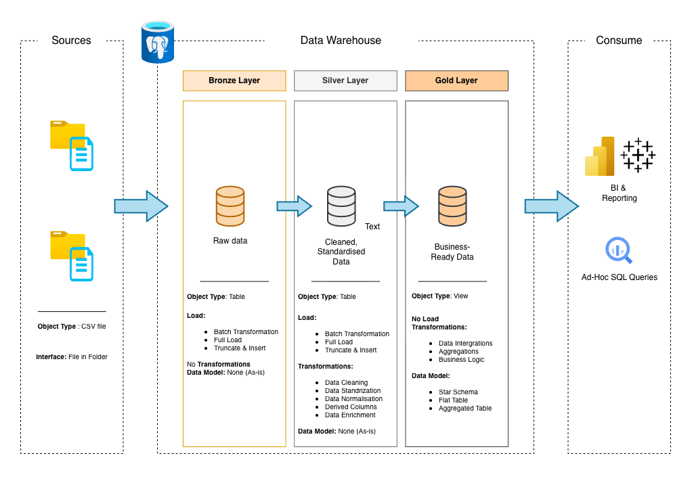
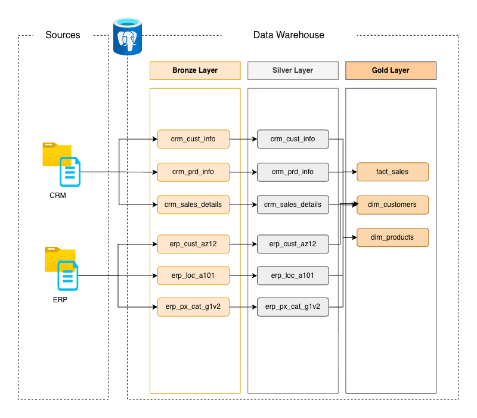

# CRM & ERP Sales Data Warehouse

## Overview

This project implements a layered analytical data warehouse that integrates CRM transactional data with ERP reference and enrichment data to support sales analytics, customer insights, and product performance reporting.

The design follows enterprise data engineering best practices, including raw schema preservation, clear separation of concerns, and star-schema modeling for analytics.

---

## Architecture Overview

The warehouse is structured using a Bronze → Silver → Gold layered architecture:
- Bronze: Raw, immutable data ingested from CRM and ERP systems
- Silver: Cleaned, standardized, and integrated datasets
- Gold: Analytics-ready dimensions and facts optimized for BI

``` code
    CRM / ERP Sources
        ↓
    Bronze (Raw)
        ↓
    Silver (Curated)
        ↓
    Gold (Analytics)
```

### Architecture Diagram

The overall system architecture and data flow are documented in the diagrams below:

- **Data Warehouse Architecture**

- **Data Flow Diagram (CRM → ERP → Warehouse)**

- **Sales Data Mart Star Schema**


These diagrams illustrate the layered Bronze → Silver → Gold design, source system integration, and analytical data models.

## Source Systems

### CRM (Customer Relationship Management)
- Owns customer, product, and sales transaction data
- Provides transactional and master data
- Batch-ingested into the warehouse

### ERP (Enterprise Resource Planning)
- Provides reference and enrichment attributes
- Authoritative source for demographics, location, and product categorization
- Used to enrich CRM entities downstream

## Datasets & Modeling

### Bronze Layer
- Raw tables mirror source schemas exactly
- No transformations, deduplication, or enrichment
- Used for auditability and reprocessing

### Silver Layer
- Standardizes column names and data types
- Applies data quality checks and deduplication
- Integrates CRM and ERP data into curated entities

### Gold Layer
- Star-schema oriented analytical models
- Dimensions:
- dim_customer
- dim_product
- Facts:
- fact_sales
- Clearly defined grain and surrogate keys

## Design Principles
- Raw schemas are immutable
- Business logic is applied only in curated layers
- Surrogate keys decouple analytics from source systems
- ERP data enriches CRM data, never overrides ownership
- Gold models are business-aligned, not source-aligned

### Data Grain Definitions
- dim_customer: One row per customer
- dim_product: One row per product
- fact_sales: One row per sales order line

Clearly defined grain ensures correct aggregations and reliable analytics.
